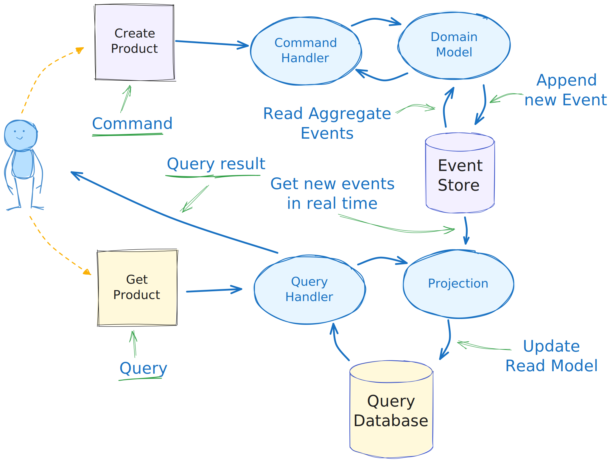

# e-commerce platform PoC

This project focuses on developing a **proof of concept** for an e-commerce platform, emphasizing two key systems: **Catalog Management** and **Promotion Management**.
It lays the groundwork for an advanced e-commerce platform capable of managing complex product data, implementing promotional strategies, and maintaining synchronization across various environments.

### 1. **Catalog Management System**

- A comprehensive solution for handling product catalogs, their classifications, and synchronization between different stages (e.g., `stage` and `online`).
- Supports importing, creating, updating, and synchronizing products with MongoDB as the primary database.
- Provides API endpoints for managing:
  - Products (with attributes, variants, and prices)
  - Categories
  - Classifications
  - Synchronization processes

### 2. **Promotion Management System**

- Manages promotional campaigns, including their creation, updates, and application to customer carts.
- Includes audit logging to track all changes and actions performed.
- Features a **Promotion Evaluation Engine** that applies discounts and tracks promotions based on cart data, integrating with commercetools for cart management.

## Tech Stack

- **Server**: [Node.js](https://nodejs.org/en)
- **Backend Framework**: [Fastify](https://fastify.dev/)
- **Database**: [MongoDB](https://www.mongodb.com/)
- **Messaging**: [NATS](https://nats.io/)
- **Search Engine**: [TypeSense](https://typesense.org/)
- **Type Validation**: [TypeBox](https://github.com/sinclairzx81/typebox)

## Key Features

- Transparent record versioning
- Transparent audit fields recording
- Audit logs
- Multitenant
- i18n text fields
- Events for indexing and auditlogging with NATS
- CQRS & EventStorming

_The project uses the "classic" CQRS pattern with an event store_



**[Catalog System](apps/catalog/README.md)**

- Import, create, and update products with dynamic attributes.
- Synchronize catalogs between staged and live environments.
- Handle classifications, categories, and validations.
- Automatic Product indexing with TypeSense

**[Promotions System](apps/promotion/README.md)**

- Create and evaluate promotions with customizable logic.
- Integration with commercetools for real-time cart data.

# Setup Instructions

1. **Clone the repository**:

   ```bash
   git clone <repository_url>
   cd <repository_directory>
   ```

2. **Install project dependencies**:

   ```bash
   npm i
   ```

3. **Install Mandatory Infrastructure**

   ```bash
   brew install mongodb/brew/mongodb-community@7.0
   ```

4. **Install Optional Infrastructure**

   ```bash
   brew install typesense/tap/typesense-server@27.1
   brew install nats-server
   ```

## Configuration

Create `.env` and `.env.test` files using the supplied `.example` files, both in the `<projectRoot>` dir, and the `<projectRoot>/apps/<project>` folders.

## Running the Application(s)

### Catalog

```bash
npm run dev -w apps/catalog
```

### Promotions

```bash
npm run dev -w apps/promotion
```

## Using the API

Refer to the [Postman Collection](docs/ecomm.postman_collection.json) for detailed API documentation and usage examples for product management operations.

## Older projects

This project is a big refactor of the old [Catalog](https://github.com/ncornag/catalog) and [Promotion](https://github.com/ncornag/promotions) projects

## License

This project is UNLICENSED.
